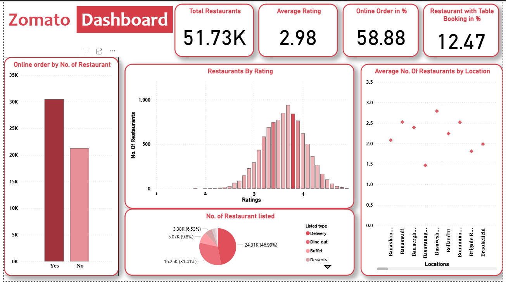
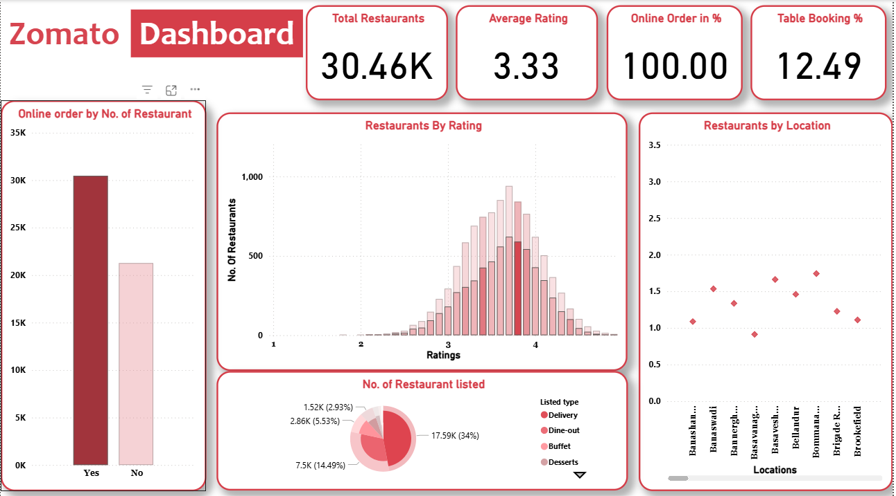

# Power BI Sales Dashboard

This Power BI report visualizes sales data across different regions and products.

## Features
- Interactive filters by region, date, and product
- KPIs like revenue, profit margin, and sales growth
- Built using Power BI Desktop and DAX measures

## Files
- `Zomato_Sales_Dashboard.pbix`: The main Power BI report
- `Zomato1.png`, `Zomato2.png`: Preview of the dashboard

## Author
Chirag Pal
